## STANFORD COURSES
http://web.stanford.edu/class/cs224n/
### Lecture 1
- Word2vec  
  - Objective Function
    - 通过句子中，以某单词前面或后面的单词取条件概率，然后贝叶斯最大似然
    - $J(\theta)=-\frac{1}{T}logL(\theta)=-\frac{1}{T}\sum_{t=1}^T\sum_{-m\leq j\leq m,j\neq 0}logP(w_{t+j}|w_t;\theta)$ 
    - 上式中，L为Likelyhood Function, J为Objective Function
  - 设$v_w$当w为center word, $u_w$ context word. 对于center word，c跟context word，o
    - $P(o|c)=\frac{exp(u_o^Tv_c)}{\sum_{w\in V}exp(u_w^Tv_c)}$
    - 上述式子相当于一个softmax
  - 梯度法求解$\theta$  
  - 变形
    - Skip-grams (SG): Predict context (“outside”) words (position independent) given center word
    - Continuous Bag of Words (CBOW): Predict center word from (bag of) context words
  - Negtive Sampling (NEG):用于替换softmax以提速
### Lecture 2
- Word2vec maximizes objective function by putting similar words nearby in space
- The skip-gram model with negative sampling (HW2)
- Negative sampling 
  - 全局 Obejective Function:
    - $J(\theta)=\frac{1}{T}\sum_{t=1}^{T}J_t(\theta)$
    - $J_t(\theta)=log\sigma (u_0^Tv_c)+\sum_{i=1}^kE_{j\sim P(w)}[log\sigma(-u_j^Tv_c)]$
  - $J_{neg-sample}(u_0,v,U)=-log\sigma(u_0^Tv_c)-\sum_{k\in\{K\ sampled\ indices\}}log\sigma(-u_k^Tv_c)$
  - 通过词语概率取k个负样本
  - 最大化real outside word appears概率（？）并最小化random words appear around center word概率（？）
  - 通过$P(w)=U(w)^{\frac{3}{4}}/Z$取样（U(w)为unigram distribution）
  - 如此这般，使得出现频率较低的词能更常出现
- Stochastic gradients with negative sampling
  - 在SGD，$\triangledown_\theta J_t(\theta)$很稀疏，导致每次只有部分词向量被更新
  - 解决方案
    - 就只更新U与V的部分行
    - 或者为词向量保留一个hash
- co-occurrence matrix
  - 窗口法 (windows) 或文档法 (full document)
    - 窗口：对每个词语取周围的词
    - 文档：全文分析，给出总体的topic
  - co-occurrence vector
    - 由于维度过高，且过分稀疏，同时在加入新的词汇时需要更新
    - 我们需要降低其维度
    - 简单的想法：SVD ，即Dimensionality Reduction on X (HW1)，然而不好算
    - 其他暴力的想法：对于出现频率过高的词，我们可以
      1. log
      2. 限制最大值为t
      3. 踢了
      4. 在windows里，对更近的词语加权，更远的则权重低
      5. 计算皮尔森
- GloVe
  - 双线性模型
    - $w_i\cdot w_j=logP(i\vert j)$
    - vector differences $w_x\cdot (w_a-w_b)=log\frac{P(x\vert a)}{P(x\vert b)}$
  - $J=\sum^V_{i,j=1}f(X_{ij})(w_i^T\tilde{w_j}+b_i+\tilde{b}_j-logX_{ij})^2$
    - $f(X_ij)$为一个scale，而后面的则表示一个差值
- 评估方案
  - Intrinsic vs. extrinsic
    - Intrinsic: 通过模型内部的方法进行评估，通常更快，但是不好说是不是真的更好
    - extrinsic：通过运行实际任务进行评估，很慢，且可能不好说这个模型有没有泛化性
  - Intrinsic word vector evaluation
    - 对于a:b::c? 比如说man:woman::king?, 我们计算
      - $d=\argmax_i\frac{(x_b-x_a+x_c)^Tx_i}{\Vert x_b-x_a+x_c\Vert}$
      - 通过其 cosine 距离评估
    - 另一个方法：用人类给出的词语相似度（比如说cat-tiger 7.35）进行比较
- 一词多义
  - 对一个词进行不同的聚类
  - 也可以将其分解为多个向量，例如
    - $v_bank=\alpha_1v_{bank_1}+\alpha_2v_{bank_2}$
    - 其中$\alpha_1=\frac{f_1}{f_1+f_2}$，f为frequency
    - 看起来不合理，但实际上由于sparse coding，我们可以将各个意思分开来！
### Lecture 3
- Named Entity Recognition (NER)
  - 目标：找出文本的名字
    - 例如：$\textit{荧}在\textit{5月2号}去\textit{稻妻}$
    - 找出，$\textit{荧}$是人名，$\textit{5月2号}$是日期，$\textit{稻妻}$是地名
  - Simple NER: Window classification using binary logistic classifier
    - idea: 通过词语附近的词来对各个词语进行分类
### Lecture 4
- Constituency = phrase structure grammar = context-free grammars (CFGs)
  - noun. phrase，比如说 a large dog
- Dependency Grammar and Dependency Structure
  - 一个词与其他词依赖关系，比如说
  - Who did Bill buy the coffee from yesterday?
  - 其中，the依赖于coffee，而coffee依赖于buy，from依赖于who而who也依赖于buy，通过这样子的方法，对一句话中词语动词结构进行分析
  - 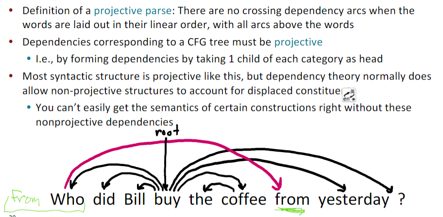
  - 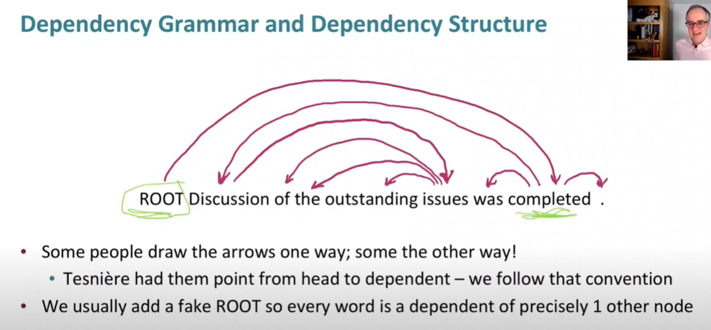
  - 还有TreeBank
    - 好处：evaluate NLP；有更多信息；更规范
  - 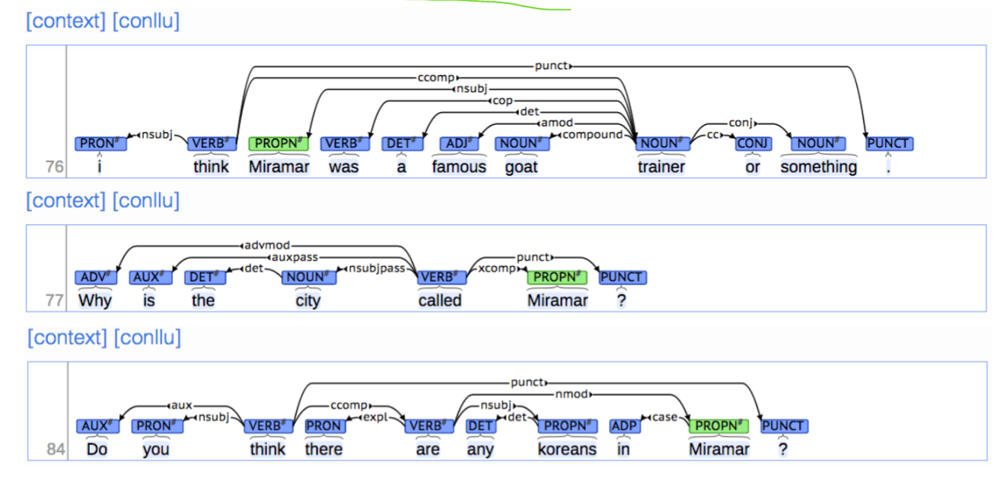
- Greedy transition-based parsing
  - 贪心法，有stack $\sigma$，buffer $\beta$，独立集$A$
  - > start: $\sigma=[ROOT],\beta=w_1,w_2,\ldots,w_n,A=\emptyset$
  - > shift: $\sigma,w_i\vert\beta,A\rightarrow\sigma\vert w_i,\beta,A$
  - > left-$arc_r$: $\sigma\vert w_i\vert w_j,\beta,A\rightarrow\sigma\vert w_j,\beta,A\cup\{r(w_j,w_i)\}$
  - > right-$arc_r$: $\sigma\vert w_j\vert w_i,\beta,A\rightarrow\sigma\vert w_i,\beta,A\cup\{r(w_i,w_j)\}$
  - >finish: $\sigma=[w],\beta=\emptyset$
  - 具体过程
  - 
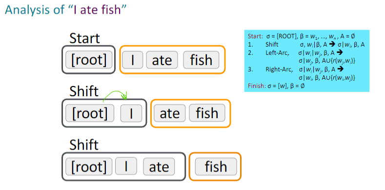
  - 
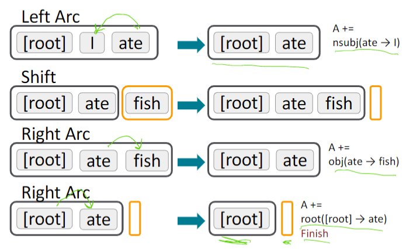
  - PS. 其中选取词需要用到机器学习啦
### Lecture 5
- Neural Dependency Parsing
  - Categorical features
    - 由于一般的分类，会是稀疏，不完整，难计算
  - Neural Approach
    - 利用神经网络的方法，我们可以用稠密的方法表示
- Language modeling
  - 目标：预测一句话下一个词
  - $P(x^{(t+1)}\vert x^{(t)},\ldots,x^{(1)})$
  - 也可以生成一整句话
  - $P(x^{(1)},\ldots x^{(T)})=P(x^{(1)})\times P(x^{(1)}\vert x^{(1)})\times P(x^{T}\vert x^{(T-1)},\ldots,x^{(1)})=\prod^T_{t=1}P(x^{(t)}\vert x^{(t-1)},\ldots,x^{(1)})$
- n-grams
  - 假定马尔可夫性: 只与前面 n-1 个词有关
  - 则有$P(x^{(t+1)}\vert x^{(t)},\ldots,x^{(1)})\\=P(x^{(t+1)}\vert x^{(t)},\ldots,x^{(t-n+2)})\\=\frac{P(x^{(t+1)},x^{(t)},\ldots,x^{(t-n+2)})}{P(x^{(t)},\ldots,x^{(t-n+2)})}$
  - PS. 要怎么计算概率呢？算词库的出现频率！
  - 对于$P(w\vert \text{students opened their})=\frac{count(\text{students opened their w})}{count(\text{students opened their})}$
    - 如果说$\textit{students opened their w}$从未出现，则需要加上一个小$\delta$平滑；
    - 如果$\textit{students opened their}$从未出现，我们可以缩短词组，比如说$\textit{opened their}$
    - 注意，这个不是拉普拉斯平滑(虽然说要用应该也没问题)
- A fixed-window neural Language Model
  - 好处: 不会太稀疏啦；没必要存储所有n-grams数据
  - 还存在的问题: fixed-window 不一定够用但太大的时候又不好使，且忽视词序
- Recurrent Neural Networks (RNN)
  - 
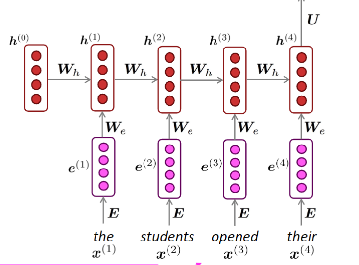
  - 计算隐藏层时，将上一个词的隐藏层也算入
  - hidden layer: $h^{(t)}=\sigma(W_hh^{(t-1)}+W_ee(t)+b_t)$
  - 其中 $e^{(t)}=Ex^{(t)}$ 为词语嵌入层
  - 最终输出$\hat{y}^{(t)}=softmax(Uh^{(t)}+b_2)$
  - 好处：
    - 利用所有信息
    - 模型不会因为一长句话而变大
    - 权重相同
  - 坏处：慢！

### Lecture 6
- RNN 
  - 损失函数：交叉熵
    - $J(\theta)=\frac{1}{T}\sum J^t(\theta)$
    - $J^t(\theta)=-log\hat{y}^t_{x_{t+1}}$
    - 理论上说，$x^t$是要是一个个词的，但是这样子算起来太慢了，所以实际上采用的是计算一句话或者一整个文档
  - $\frac{\partial J^t}{\partial W_h}=\sum \frac{\partial J^t}{\partial W_h}\vert_i$
  - 生成句子
    - 第一层生成一个，第二次生成一个，$\ldots$ 
    - 
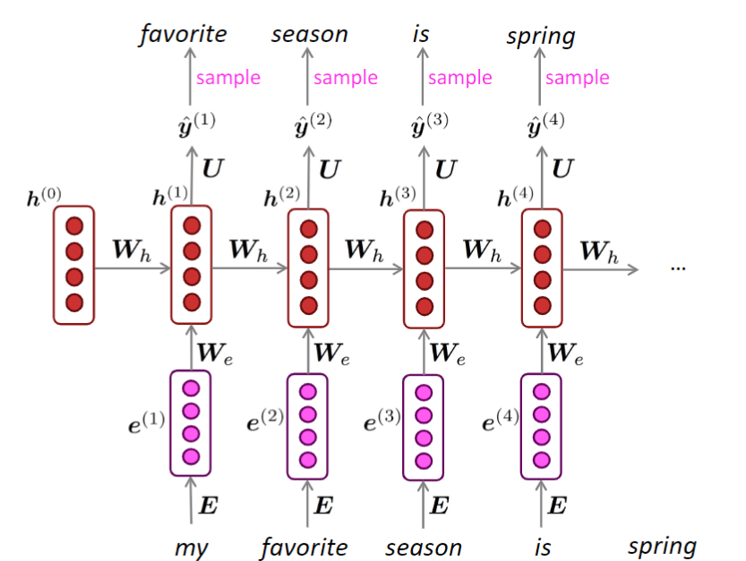
  - $perplexity=\prod(\frac{1}{P_{LM}(x^{t+1}\vert x^t,\ldots,x^1)})=\exp(J(\theta))$
  - $perplexity$越低越好
  - RNN也可以用作除了Language Model以外的作用，比如说classification，sentence encoding
  - RNN缺陷
    - 梯度消失vanishing gradient 
    - 梯度爆炸exploding gradient
      - 解决方案：Gradient clipping
      - 将gradient缩小后再进行更新（相当于方向相同，但是大小缩小）
- Long Short-Term Memory (LSTM)
  - 模型解释
    - 在t步，有hidden state $h^t$和cell state $c^t$
      - vectors length n
      - cell存放长期信息long-term information
      - lstm 可以通过cell来read/erase/write，就想计算机的RAM
    - read/erase/write通过gates来进行控制
      - gates vectors length n
      - gates的状态可以open（1），close（0）或者介于二者间
      - gates受当前内容动态变化
  - 结构
    - Forget gate: controls what is kept vs     forgotten, from previous cell state
      - $f^t=\sigma(W_fh^{t-1}+U_fx^t+b_f)$
    - Input gate: controls what parts of the  new cell content are written to cell
      - $i^t=\sigma(W_ih^{t-1}+U_ix^t+b_i)$
    - Output gate: controls what parts of cell  are output to hidden state
      - $o^t=\sigma(W_oh^{t-1}+U_ox^t+b_o)$
    - 注意，以上的$\sigma(x)$皆为$sigmoid$，为了控制概率。以上gate决定了哪些要遗忘，哪些要保留
    - New cell content: this is the new content to be written to the cell
      - $\hat{c}^t=\tanh(W_ch^{t-1}+U_cx^t+b_c)$
    - Cell state: erase (“forget”) some content from last cell state, and write (“input”) some new cell content
      - $c^t=f^t \circ c^{t-1}+i^t\circ c^t$
    - Hidden state: read (“output”) some content from the cell
      - $h^t=o^t\circ \tanh c^t$
    - $\circ$: Hadamard product，
      - $(A\circ B)_{ij}=A_{ij}B_{ij}$
    - 算法流程图
      - 
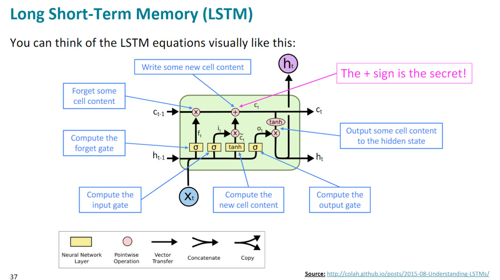
### Lecture 7
- Machine Translation(MT)
  - Machine Translation (MT) is the task of translating a sentence x from one language (*the source language*) to a sentence y in another language (*the target language*).
  - Statistical Machine Translation(SMT)
    - $\argmax_yP(y\vert x)$
    - y为*the target language*，x为*the source language*
    - 数据集：parallel data（差不多就是已经有的翻译）
    - alignment: word-level correspondence between source sentence x and target sentence y
    - 
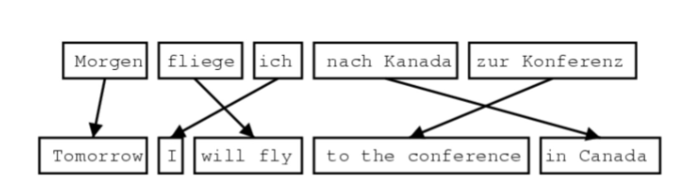
    - 不过可能出现多词同义，不同语言没有对应的词等问题
    - $\argmax_yP(x\vert y)P(y)$
    - decoding: Impose strong independence assumptions in model, use dynamic programming for globally optimal solutions (e.g. Viterbi algorithm)
- Neural Machine Translation(NMT)
  - sequence-to-sequence(Seq2Seq): two RNNs
    - 
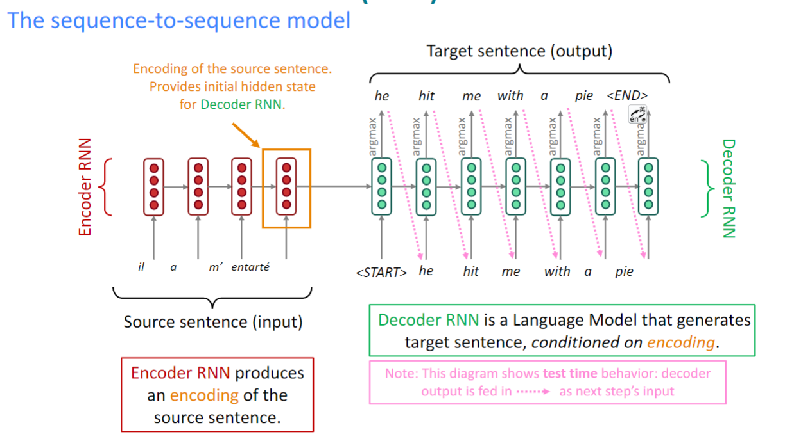
    - 用途还有
      - Summarization (long text → short text)
      - Dialogue (previous utterances → next utterance)
      - Parsing (input text → output parse as sequence)
      - Code generation (natural language → Python code)
  - Conditional Language Model
    - *Language Model*： because the decoder is predicting the next word of the target sentence y
    - *Conditional*： because its predictions are also conditioned on the source sentence x
    - $P(y\vert x)=P(y_1\vert x)P(y_2\vert y_1,x)\ldots P(y_r\vert y_1,\ldots,y_{r-1},x)$
  - Multi-layer RNNs
    - The lower RNNs should compute lower-level features and the higher RNNs should compute higher-level features. 
  - Greedy decoding
    - take most probable word on each step
    - problem: Greedy decoding has no way to undo decisions
    - 改进一：Exhaustive search decoding
      - $P(y\vert x)=\prod P(y_t\vert y_1,\ldots,y_{r-1},x)$
        - 不过这个方法显然不好算，有够蠢
    - 改进二：Beam search decoding
      - Core idea: On each step of decoder, keep track of the k most probable partial translations (which we call hypotheses)
        - k is beam size
      - score $y_1,\ldots,y_t$, and higher score is better
      - $score(y_1,\ldots,y_t)=logP_{LM}(y_1,\ldots,y_t\vert x)=\sum P_{LM}(y_i\vert y_1,\ldots,y_{i-1}, x)$
      - 虽然不一定对，但是比Exhaustive search decoding好
      - 可以看作一种广度搜索树，然后分支只保留k个
      - 结束
        - 到达timestep T
        - have n completed hypotheses 
      - problem: longer hypotheses have lower scores
        - solution: Normalize by length. Use this to select top one instead:
        - $\frac{1}{t}\sum\log P_{LM}(y_i\vert y_1,\ldots,y_{i-1},x)$
  - Disadvantages
    - less interpertable
    - difficult to control 
- Evaluation
  - BLEU (Bilingual Evaluation Understudy)
    - BLEU compares the machine-written translation to one or several human-written translation(s), and computes a similarity score based on:
    - n-gram precision (usually for 1, 2, 3 and 4-grams)
    - Plus a penalty for too-short system translations
### Lecture 8
- Attention
  - Core idea: on each step of the decoder, use *direct connection* to the encoder to focus on a particular part of the source sequence
  - Sequence-to-sequence with attention
    - 
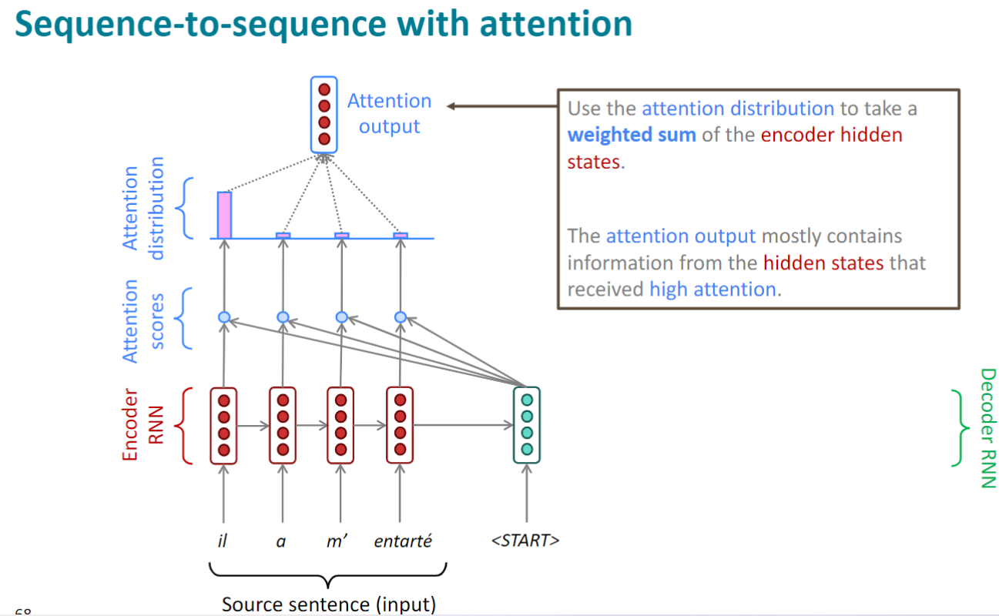
    - 
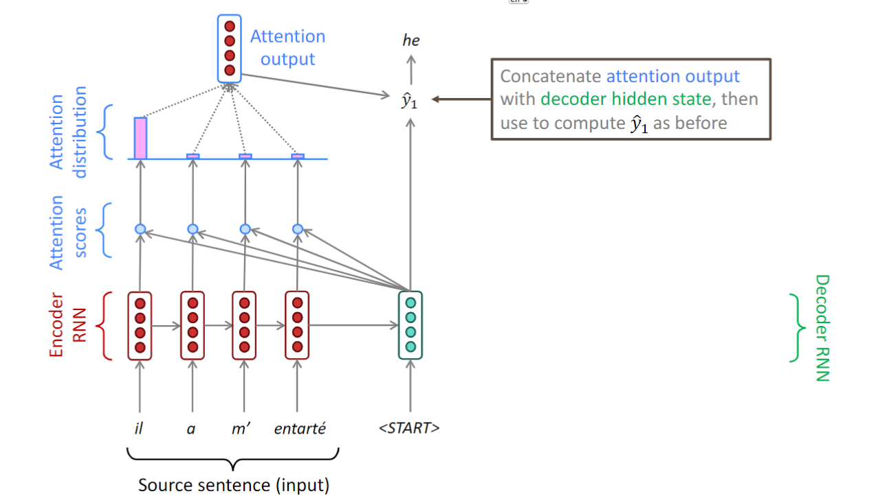
    - 
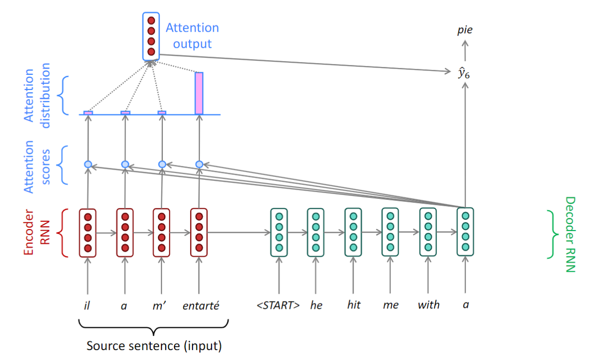
  - 计算：
    - attention score
      - $h_1,\ldots,h_N$ for encoder hidden states, $s_t$ for decoder hidden states
      - $e^t=[s_t^Th_1,\ldots,s_t^Th_N]\in R^N$
      - $e^t$ is attention score
    - attention distribution
      - $\alpha^t=softmax(e^t)\in R^N$
      - $a_t=\sum a^t_ih_i$
    - 输出 attention output $a_t$ 和decoder hidden state $s_t$
      - $[a_t;s_t]\in R^{2h}$
  - advantages
    - interpretability!:
      - By inspecting attention distribution, we see what the decoder was focusing on
  - More about attention
    - DEFINATION: Given a set of vector values, and a vector query, **attention** is a technique to compute a *weighted sum* of the values, dependent on the query.
    - query attends to the values
    - The weighted sum is a *selective summary* of the information contained in the values, where the query determines which values to focus on.
    - Attention is a way to obtain a *fixed-size representation of an arbitrary set of representations*(the values), dependent on some other representation (the query).
### Lecture 9
- Self-attention
  - 一般的attention: encoder-decoder
  - self-attention: encoder-encoder or decoder-decoder
  - 过程  
    1. query, key, value: $q_i=W^Qx_i,k_i=W^Kx_i,v_i=W^Vx_i$
    2. score: $e_{ij}=q_i k_j$
    3. $\alpha=softmax(e_{ij})$
    4. $output_i=\sum \alpha_{ij}v_j$
  - 也可以向量化
    1. $Q=XW^Q, K=XW^K, V=XW^V$
    2. $E=QK^T$
    3. $A=softmax(E)$
    4. $Output=AV$ 
  - 是不是看起来很像全连接层（笑）
    - 不过这边的$k$是一种动态的联系function，而不是全连接层的那种慢慢修正的权重 
  - 注意，没有特殊处理的attention是忽视顺序的
    - $p_i\in R^d$ to be position vectors
    - $v_i=\tilde{v_i}+p_i,\\ q_i=\tilde{q_i}+p_i,\\ k_i=\tilde{k_i}+p_i$
    - 其中$\tilde{v_i},\tilde{q_i},\tilde{k_i}$为旧的值
    - 常见的设置$p$的方法：三角函数或者用一组可学习的矩阵
  - ps. 现在的self-attention是线性的
    - $m_i=W_2*RELU(W_1\times+b_1)+b_2$
    - 这样子直接加个非线性函数就可以啦
  - Mask
    - 为了防止训练时，把出现的下一个词提早看到，我们要阻止它see the future. 就是说遮住下一个词啦
    - $$e_{ij}=\left\{
      \begin{aligned}
      & q_i^Tk_j,j<i\\
      & -\infty,j\geq i 
      \end{aligned}
      \right.$$
- Encoder-Decoder Transformer
  - Key-Query-Value Attention
    1. $x_1,\ldots,x_T$为输入
    2. $k_i=Kx_i,\\q_i=Qx_i,\\v_i=Vx_i$
    3. $output=softmax(XQ(XK)^T)\times XV$
  - Multi-headed attention
    - MOTIVATION: What if we want to look in multiple places in the sentence at once
      - For word i, self-attention "looks" where $x_i^TQ^TKx_j$ is high
      - What if we want to focus on different j ?
    - Solution
      - $Q_l,K_l,V_l\in R^{d\times \frac{d}{h}}$，其中h为 number of attention heads
      - $output_l=softmax(XQ_lK_l^TX^T)*XV_l$
      - $output=Y[output_1;\ldots;output_h]$
      - Y is a learned matrix
  - Residual connection
    - help train better
    - Instead of $X^i=layer(X^{i-1})$
    - We let $X^i=X^{i-1}+layer(X^{i-1})$ 
  - Normalization
    - train faster
    - $output=\frac{x-\mu}{\sigma+\epsilon}*\gamma+\beta$
    - 其中$\epsilon$为防止分母为0, $\gamma$ is gain and $\beta$ is "bias"(i don't know whether is useful)
  - Scale Dot Product
    - 为了防止softmax()里面过大导致最终梯度过小
    - instead of $softmax(XQ_lK_l^TX^T)*XV_l$
    - we use $softmax(\frac{XQ_lK_l^TX^T}{\sqrt{d/h}})*XV_l$
  - 结合上述
    - Encoder block
      - 
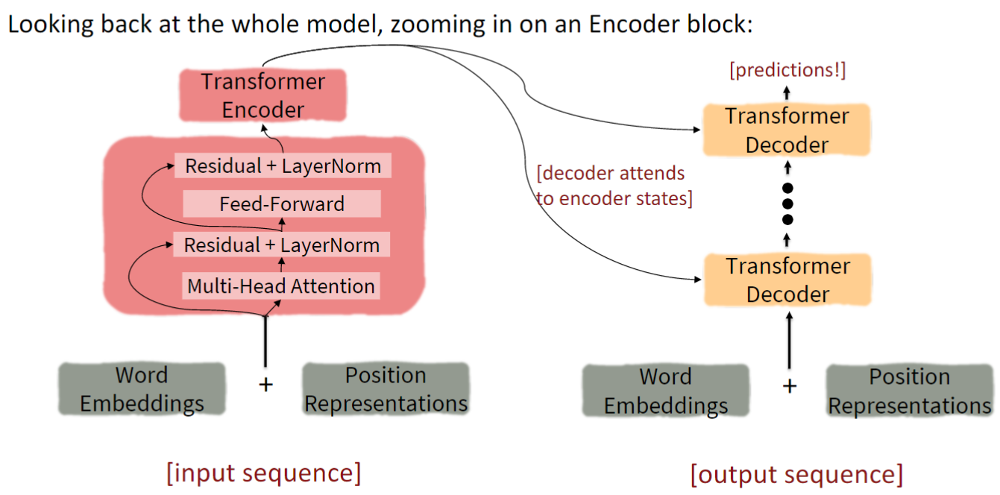
    - Decoder block
      - 
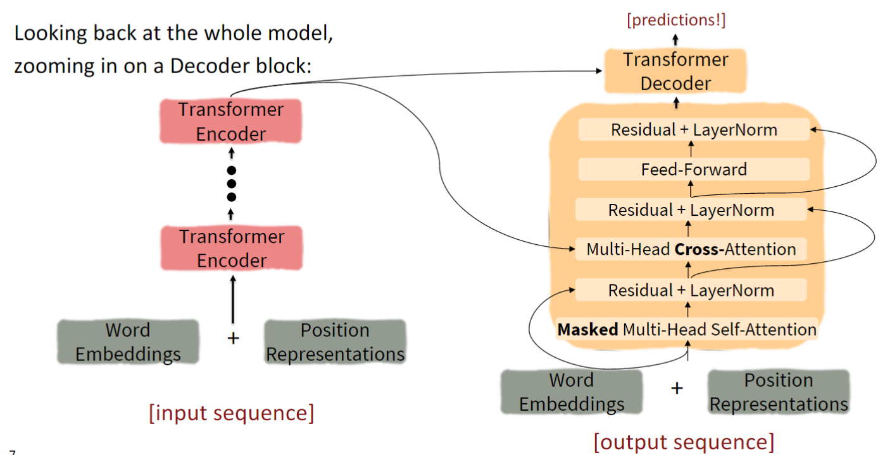
  - Cross-attention (decoder only )
    - $h_1,\ldots,h_T$ 为 encoder 的 output
    - $z_1,\ldots,z_T$ 为 decoder 的 input
    - keys and values 来自 encoder
      - $k_i=Kh_i,v_i=Vh_i$
    - query 来自 decoder
      - $q_i=Qz_i$
    - $H=[h_1;\ldots;h_T]\\ Z=[z_1;\ldots;z_T]$
    - $output=softmax(ZQ(HK)^T)\times HV$
- 扩展阅读
  - [illustrated transformer](http://jalammar.github.io/illustrated-transformer/ "")
  - [seq2seq models with attention](https://jalammar.github.io/visualizing-neural-machine-translation-mechanics-of-seq2seq-models-with-attention/ "")
### Lecture 10
- Subword models
  - 比如说 coooooooool 是cool的变形, ture 是拼错了的 true, 还有各种生造词
  - Subword modeling in NLP encompasses a wide range of methods for reasoning about structure below the word level. (Parts of words, characters, bytes.)
  - 主流方法是将词语分出 subwords 
- Byte-pair encoding
  - 用处: defining a subword vocabulary
  - 过程
    1. 以单字母集合与一个"end-of-word"开始
    2. 将集合中邻近的字母看作一块的，比如说"a,b"看作"ab"
    3. 重复上述
  - 经过上述，比如说apple就是apple，coooooool就可以是co##oooooo##l，Transformerify就是Transformer##ify
- Pretraining
  - Pretraining methods hide parts of the input from the model, and then train the model to reconstruct those parts
  - 几乎所有的NLP都用上pretraining，用于参数的初始化
  - 用途
    - representations of language
    - parameter initializations for strong NLP models
    - probability distributions over language that we can sample from
  - Pretrain Decoders
    - 就是Language Model
    - Nice to generate from; can’t condition on future words
    - example: GPT-2, GPT-3, LaMDA
- Natural Language Inference(NLI)
  - 对于给定的一组句子，说明它们的关系是蕴含/矛盾/中立的
  - 比如说，有猫在桌子上蕴含了有动物在桌上
- Pretraining decoders
  - $h_1,\ldots,h_T=Decoder(w_1,\ldots,w_T)\\y\sim Aw_T+b\\w_t\sim Aw_{t-1}+b$
  - 其中A和b是LM中pretrain的参数
  - 
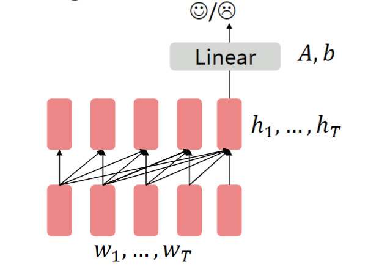 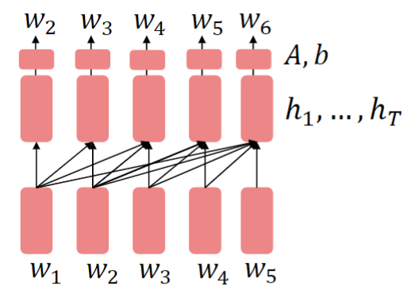
- Pretraining encoders
  - Problem: encoders get bidirectional context, so we can’t do language modeling!
  - Masked LM
    - Idea: replace some fraction of words in the input with a special [MASK]  token; predict these words.
    - $h_1,\ldots,h_T=Encoder(w_1,\ldots,w_T)\\y_i\sim Aw_i+b$
    - 对于$\tilde{x}$作为marked $x$, 微妙学习$p_\theta(x\vert \tilde{x})$
    -  
  - BERT: Bidirectional Encoder Representations from Tranformers
    - 就是Marked LM 
    - Details: Predict a random 15% of (sub)word tokens.
      - Replace input word with [MASK] 80% of the time
      - Replace input word with a random token 10% of the time
      - Leave input word unchanged 10% of the time (but still predict it!)
    - Why? 相当于是统计学上，让模型能理解语义。
    - 
  - PS. Pretrain Encoder like BERT 跟 Pretrain Decoder like GPT本质是处理不同的东西，不好说随意对比（encoder可以说是文字填空解字谜，decoder则是续写内容）
- Pretraining encoder-decoders
  - 我们又可以做LM啦！encoder部分用于双向文本，decoder部分则用作LM
  - $h_1,\ldots,h_T=Encoder(w_1,\ldots,w_T)\\h_{T+1},\ldots,h_2=Decoder(w_1,\ldots,w_T,h_1,\ldots,h_T)\\y_i\sim Aw_i+b,i>T$
  - 

  - 

  - 用处：我们可以把encoder读到的部分文本，用于填充decoder要完成的残缺文本
    - 实际上！我们可以用来做为问答小百科
    - 比如说：中国首都在哪？encoder-decoder:中国首都在北京
### Lecture 11
- Question Answering
  - The goal of question answering is to build systems that automatically answer questions posed by humans in a natural language
  